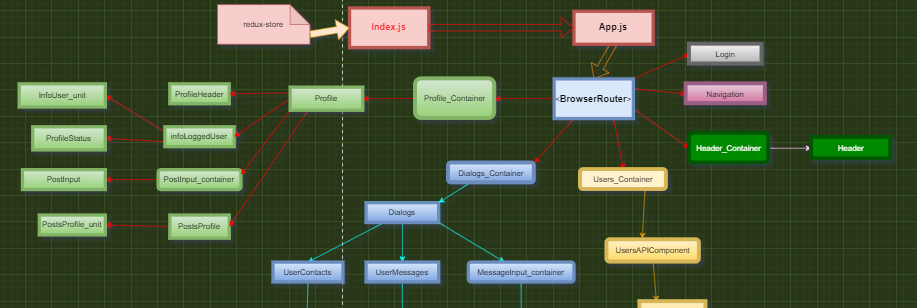

<h1 align="center">Social Network Traning Project</h1>



<h2>Description</h2>
<p>
Created as an imitation of a social network, focused on a component approach.
</p>
<h3>Target</h3>
<p>A project for practical skills in learning the principles of the component approach and React / Redux.<br>
It is not used for indicative purposes, but only for the introduction and development of the project during the learning stages.</br>.
</p>
<h3>Technologies</h3>
<p>- CSS</p>
<p>- JavaScript</p>
<p>- json-server</p>
<p>- React</p>
<p>- Redux</p>
<h2>Project settings</h2>
<p>
    1. First you need to clone all files and folders to your device.
</p>
<p>
    2. Check if <b> nodeJS </b> and <b> npm </b> are installed in the cmd terminal or another available in your editor.
</p>

```
node -v
npm --v
```

<p> If an error occurs at this stage, you can install nodeJS from the official site <a href="https://nodejs.org/en/"> <b> NodeJS </b> </a> </p>

<p>
3. If the versions were shown in the terminal, then the next step is to install all project dependencies.
</p>

```
npm install 
```

4. After some time has passed and the installation is complete, you need to start the server.


```
json-server --watch db.json
```

5. After the server is launched on http: // localhost: 3000 /, launch the project itself.

```
npm start
```

6. Done. The project is available at http: // localhost: 3001 /

<h3>
Further project</h3>
• There is no main direction, the development of the project depends on training.

<h3>More about</h3>

You can read more in the [Create React App documentation](https://facebook.github.io/create-react-app/docs/getting-started).

To read about React, check out the [React documentation](https://reactjs.org/).